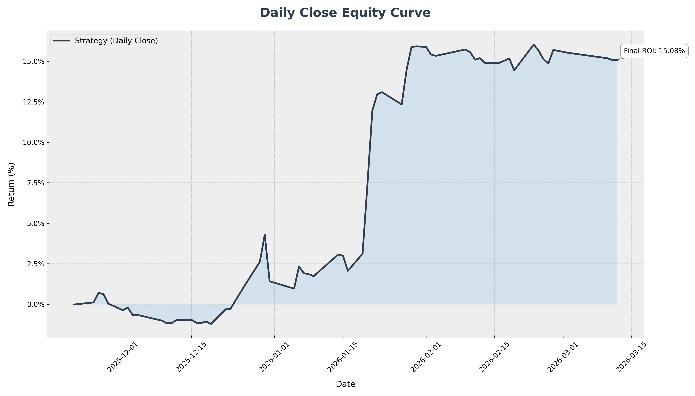
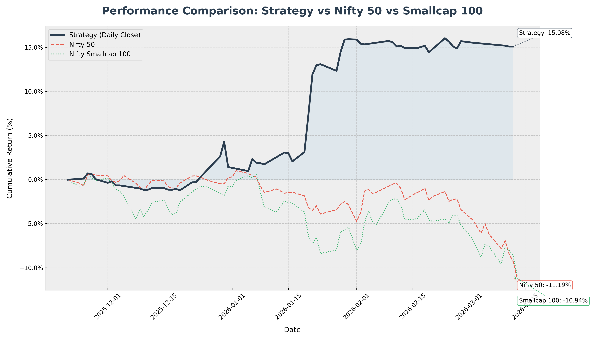
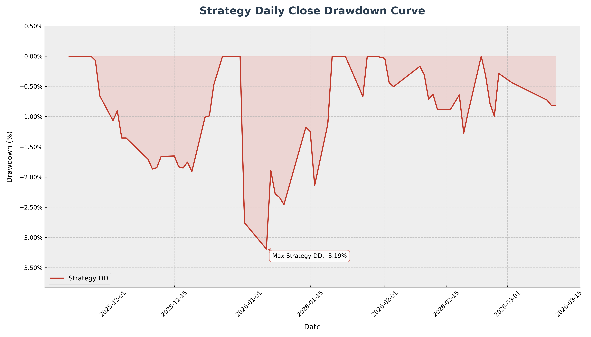

# Performance Validation Appendix — Private Proprietary Trading Stack

> **Companion document to:** *Private Multi-Asset Trading Stack — Overview, Validation, and Event Studies*  
> **Scope:** Validation-phase performance, drawdown behavior, stress events, and supporting evidence  
> **Status:** Internal-style summary prepared from operator records, internal reports, and validation snapshots

---

## Table of Contents

1. [Executive Dashboard](#1-executive-dashboard)
2. [Live Events Handled by the Stack](#2-live-events-handled-by-the-stack)
3. [Document Status / Disclosure](#3-document-status--disclosure)
4. [Methodology Notes](#4-methodology-notes)
5. [Purpose of This Appendix](#5-purpose-of-this-appendix)
6. [Validation Window](#6-validation-window)
7. [Benchmark Context](#7-benchmark-context)
8. [Drawdown Analysis](#8-drawdown-analysis)
9. [Choppy Market Regime Validation](#9-choppy-market-regime-validation)
10. [Precious Metals Crash Event Study — February 2026](#10-precious-metals-crash-event-study--february-2026)
11. [War Scenario Event Study — Feb 28 to Mar 2, 2026](#11-war-scenario-event-study--feb-28-to-mar-2-2026)
12. [System Features Most Relevant to Risk Survival](#12-system-features-most-relevant-to-risk-survival)
13. [What the Evidence Supports So Far](#13-what-the-evidence-supports-so-far)
14. [Known Limitations](#14-known-limitations)
15. [Relationship to Public Repositories](#15-relationship-to-public-repositories)
16. [Closing Interpretation](#16-closing-interpretation)

---

## 1. Executive Dashboard

### Validation Snapshot

| Metric | Current Observation |
| :--- | :--- |
| Report Period | **21 Nov 2025 → 15 Mar 2026** |
| Validation Mode | **Live paper-trading** |
| Testing Start Date | **21 Nov 2025** |
| Deployment Stage | **Testing / validation phase** |
| Pricing Reality | **Slippage-aware / tick-to-tick monitored** |
| Overall Return | **~14.68%** |
| Sharpe Ratio    | **2.11**    |
| Sortino Ratio   | **3.24**    |
| Daily-Close Max Drawdown | **-3.19%** |
| High-Precision Max Drawdown | **-3.85%** |
| Equity Sleeve Performance | **~ -1%** |
| Reporting Granularity | **63 daily snapshots vs 179,000+ high-precision records** |
| Current Conclusion | **Promising validation-phase behavior, not final proof** |

### Why Paper Mode Is Being Used

| Item | Current Position |
| :--- | :--- |
| Current stage | **System still under testing** |
| Why paper mode? | **To validate live behavior before stronger deployment claims** |
| Are live conditions considered? | **Yes** |
| Is slippage considered? | **Yes** |
| Is tick-to-tick market behavior considered? | **Yes** |
| Is this an audited investor statement? | **No** |

### Suggested Chart Placement

Embed the following immediately below this section in your repo:

## Equity Curve

## Benchmark Comparison

---

## 2. Live Events Handled by the Stack

| Event / Regime | What happened | Why it matters |
| :--- | :--- | :--- |
| Extended choppy NSE regime | system stayed relatively resilient while benchmarks were weak | tests survivability outside ideal trends |
| February 2026 precious-metals crash | commodity exposure was materially reduced / exited before full damage | validates exit discipline and crash defense |
| War / shock-sensitive market regime | stack maintained process discipline across NSE and MCX under abnormal conditions | tests behavior under geopolitical stress |
| Intraday path-risk vs close-only reporting | high-precision DD captured more truthful risk than smooth daily-close view | improves analytical credibility |

---

## 3. Document Status / Disclosure

| Item | Status |
| :--- | :--- |
| System code | **Private** |
| Deployment stage | **Live testing / paper mode** |
| Slippage modeled | **Yes** |
| Tick-to-tick monitoring | **Yes** |
| Human supervision | **Yes** |
| Audited investor statement | **No** |
| Public code availability | **Not shared** |
| Real-capital production claim | **Not made in this document** |

---

## 4. Methodology Notes

| Methodology Item | Current Treatment |
| :--- | :--- |
| Report window | **21 Nov 2025 → 15 Mar 2026** |
| Return measurement | validation-phase portfolio return snapshot |
| Drawdown measurement | both daily-close and high-precision path-aware views |
| Slippage treatment | modeled / considered in paper-mode workflow |
| Tick handling | tick-to-tick LTP-aware monitoring |
| Benchmark logic | Nifty + smallcap-oriented comparison for context |
| Equity sleeve meaning | equity-only portion of broader multi-asset stack |
| Manual overrides | possible and disclosed where relevant |

---

## 5. Purpose of This Appendix

This appendix captures the **current validation-phase performance** of my private proprietary trading stack.

It is meant to document:

| What this appendix covers | Why it matters |
| :--- | :--- |
| evaluation period | defines the testing window |
| current performance behavior | shows what the stack has done so far |
| drawdown characteristics | shows how risk behaved |
| stress-event response | tests whether the stack survives hostile conditions |
| human intervention boundaries | keeps the document honest |

This is **not** an audited investor document and should not be read as a claim of guaranteed future performance. It is a structured summary of a private system under active validation.

---

## 6. Validation Window

### Report Window
The current validation report covers the period from **21 Nov 2025 to 15 Mar 2026**.

### Live Validation Start
The current live paper-trading phase began on **21 Nov 2025**.

### Operating Assumptions
This validation phase is intended to reflect live conditions as closely as possible, including:

| Validation Input | Included in Current Phase |
| :--- | :--- |
| broker-facing workflow constraints | **yes** |
| tick-to-tick LTP awareness | **yes** |
| slippage-aware logic | **yes** |
| real-time alerts and execution timing | **yes** |
| live regime effects | **yes** |
| clean backtest-only assumptions | **no** |

### Scope of Current Assessment
The current evidence covers a period characterized by:

- a difficult and choppy NSE regime
- war/shock-sensitive market behavior
- a major precious-metals crash in MCX contracts
- multi-asset exposure management across equities and commodities

---

## 7. Benchmark Context

The validation period has not been a clean bull market. It has been a difficult regime marked by chop, reversals, and stress-sensitive moves.

### Benchmark Readout

| Benchmark Context | Current Reading |
| :--- | :--- |
| Nifty backdrop *(as of 15 Mar 2026)* | **~ -12%** |
| smallcap-oriented benchmark *(as of 15 Mar 2026)* | **~ -12%** |
| equity sleeve | **~ -1%** |
| overall stack | **positive overall (~14.68%)** |

### Why Benchmark Choice Matters
For equity comparison, a broad or smallcap-sensitive benchmark can be more representative than a narrow large-cap benchmark when strategy exposure spans wider market behavior. The goal of comparison here is not optics, but realism.

### Comparative Readout

| Item | Return / Reading |
| :--- | :--- |
| Private stack overall | **~ +14.68%** |
| Equity sleeve | **~ -1%** |
| Nifty | **~ -12%** |
| Smallcap-oriented benchmark | **~ -12%** |

---

## 8. Drawdown Analysis

### Daily-Close View vs High-Precision View
One of the most important analytical distinctions in the current reporting is the difference between:

- **daily close snapshots**
- **high-precision / intraday-equivalent logs**

This matters because daily-close reporting often understates the real path risk experienced inside the session.

### Reported Difference

| Metric | Daily Close Snapshot | High-Precision Log |
| :--- | :--- | :--- |
| Max Drawdown | **-3.19%** | **-3.85%** |
| Reporting Style | smoothed end-of-day | granular path-aware |
| Risk Visibility | lower | higher |
| Usefulness | reporting-friendly | more realistic risk picture |

### Interpretation
This is a positive sign analytically because it shows that the reporting framework is not pretending that close-to-close performance tells the full truth. The system is being evaluated against both smoother reporting and more realistic path-aware risk tracking.

### Suggested Chart Placement

Embed your drawdown chart here:

## Drawdown Chart

---

## 9. Choppy Market Regime Validation

A large part of the current validation period took place in a **highly choppy equity environment**.

This matters because choppy regimes are where many systems fail quietly through:

- overtrading
- false breakouts
- repeated stop-outs
- inability to preserve capital
- poor benchmark-relative behavior despite looking fine in backtests

### Choppy Regime Readout

| Observation | Interpretation |
| :--- | :--- |
| overall stack remained positive | indicates regime resilience |
| equity sleeve stayed around **~ -1%** | materially stronger than deeply negative benchmarks |
| drawdown remained contained | suggests defensive behavior worked |
| system did not rely on one clean trend regime | improves robustness narrative |

### Why This Matters
A system that survives chop with controlled damage is often more valuable than a system that looks spectacular only in ideal trend environments.

---

## 10. Precious Metals Crash Event Study — February 2026

One of the strongest stress tests so far came from the **February 2026 crash in precious metals**, where Indian commodity markets experienced an extreme collapse in gold and silver contracts.

Internal review indicates that most commodity positions had already been materially reduced or exited before the full crash impact unfolded.

### Why This Event Matters

| Stress Question | What was being tested |
| :--- | :--- |
| could weakness be detected early? | signal and regime sensitivity |
| could exposure be reduced in time? | exit discipline |
| could capital be protected? | risk architecture |
| could the stack act before hindsight became obvious? | real operating usefulness |

### Internal Market Impact Snapshot

| Instrument | Peak Price | Crash Low | Drop (%) |
| :--- | :--- | :--- | :--- |
| MCX Silver Futures | ~₹4,21,000 | ~₹2,26,000 | **-46.18%** |
| MCX Silver Micro | ~₹4,28,000 | ~₹2,31,000 | **-46.05%** |
| MCX Silver Mini | ~₹4,22,000 | ~₹2,33,000 | **-45.30%** |
| MCX Gold Futures | ~₹1,81,000 | ~₹1,42,000 | **-24.65%** |
| MCX Gold Petal | ~₹19,100 | ~₹15,000 | **-21.52%** |

### Approximate Exit-Price Snapshot

| Instrument | Exit Date | Approx Exit Price | Crash Low | Avoided Loss per Unit |
| :--- | :--- | :--- | :--- | :--- |
| MCX:SILVER | Jan 29, 2026 | **~₹3,77,000** | ~₹2,26,000 | **~40.1%** |
| MCX:SILVERM | Jan 29, 2026 | **~₹3,85,000** | ~₹2,33,000 | **~39.5%** |
| MCX:SILVERMIC | Jan 29, 2026 | **~₹3,95,000** | ~₹2,31,000 | **~41.5%** |
| MCX:GOLDM | Jan 29, 2026 | **~₹1,71,000** | ~₹1,42,000 | **~16.9%** |
| MCX:GOLDPETAL | Jan 29, 2026 | **~₹18,300** | ~₹15,000 | **~18.1%** |

### Avoided-Loss Scenario Analysis

| Scenario | Estimated Impact |
| :--- | :--- |
| silver positions held through full crash | **~6–8% of capital** |
| gold positions held through full crash | **~1–3% of capital** |
| conservative total avoided loss | **~8–12% of capital** |

### Important Disclosure
During this period, the system was not operating as a mythology-grade fully autonomous robot. Alerts, stops, and execution logic did their job — but operator involvement also contributed to minimizing damage when notified levels were triggered. That is an important part of the real-world operating model.

---

## 11. War Scenario Event Study — Feb 28 to Mar 2, 2026

A second major event study comes from the **Iran–US war scenario period** spanning **Feb 28 – Mar 2, 2026**.

This matters because it tested the stack under:

- geopolitical shock
- gap-down open conditions
- intraday volatility spikes
- cross-asset behavior in both equities and MCX instruments

### Architecture Note from Internal Review

| Component | Description |
| :--- | :--- |
| signal engine | **pure price-action driven** |
| news awareness | **none** |
| watchlist source | **operator curated** |
| execution style | **structured breakout / tranche-based** |
| risk handling | **dynamic and process-driven** |

### Event Readout

| Observation | Why it matters |
| :--- | :--- |
| positions were built before the catalyst became public | supports price-action responsiveness |
| system did not panic-exit on the shock open | shows process discipline |
| multiple equity names were exited into recovery strength | supports structured profit extraction |
| one MCX India entry was mistimed near intraday volatility peak | shows realistic non-perfect execution behavior |

### Representative Trade Summary from the War Scenario

| Symbol / Instrument | Context | Exit Type / Status | Outcome | Why it mattered |
| :--- | :--- | :--- | :--- | :--- |
| BHARATFORG | pre-catalyst breakout participation | smart system exit | strong profit | showed disciplined extraction into strength |
| NETWEB | breakout-driven equity participation | smart system exit | strong profit | validated structured exit behavior |
| APARINDS | multi-tranche equity participation | tranche exits | cumulative strong profit realization | showed scaling and phased profit-taking |
| MTARTECH | volatile equity participation | partial manual + later stop-driven | mixed but controlled | useful example of real non-perfect execution |
| SILVER26MARFUT | commodity exposure during shock regime | risk-free / monitored | protected state | showed commodity-side risk handling |
| MCX India (equity) | entry near volatility peak | still monitored / mildly adverse | weaker timing | useful example of timing risk under stress |

### Important Disclosure
The internal war report reflects a real operating model where **human operator curates watchlist → price-action engine detects breakout signals → autonomous tranche execution → dynamic risk management**. That disclosure increases credibility rather than reducing it.

---

## 12. System Features Most Relevant to Risk Survival

From the current validation evidence, the following features appear most relevant to survivability:

| Feature | Why it matters |
| :--- | :--- |
| layered stop and drawdown protection | limits catastrophic damage |
| risk-aware scaling and tranche exits | improves exit quality |
| reconciliation between intended and actual state | reduces operational drift |
| portfolio-level exposure awareness | prevents blind position stacking |
| analytics beyond headline P&L | reveals path risk |
| alerts and mobile workflows | supports timely response |
| multi-asset handling | avoids siloed execution thinking |

---

## 13. What the Evidence Supports So Far

### Strengths Observed

| Strength | Why it matters |
| :--- | :--- |
| resilient behavior in hostile conditions | survival matters more than cosmetic backtests |
| contained drawdown | supports capital-preservation thesis |
| distinction between smoothed and granular risk | improves reporting honesty |
| reduced damage in crash-sensitive commodities | validates exit discipline |
| workflow maturity beyond one backtest | indicates ecosystem thinking |
| integrated analytics + alerts + execution support | supports real usability |

### What This Does **Not** Yet Prove

| Limitation | Why it should be stated |
| :--- | :--- |
| does not prove permanent edge | avoids overclaiming |
| does not guarantee future live profitability | keeps document honest |
| not a substitute for long-horizon audited deployment | sets correct expectation |
| does not remove need for operator judgment | reflects real operating model |

That is why the current stance should be **confident, but evidence-led**.

---

## 14. Known Limitations

| Limitation | Why it matters |
| :--- | :--- |
| current phase is still paper-mode validation | results are promising but not final deployment proof |
| operator supervision remains part of the process | this is not a zero-human black box claim |
| private codebase is not publicly auditable | readers must evaluate via evidence rather than source access |
| current report window is still limited in length | longer-cycle validation is still needed |
| event studies are strong but not exhaustive | more regimes still need to be observed |

This does not weaken the system narrative. It makes the document more honest and more useful.

---

## 15. Relationship to Public Repositories

The public repositories on my GitHub should be understood as **visible fragments** of a broader private operating stack.

| Public Repo Role | Meaning |
| :--- | :--- |
| public-safe tools | visible outputs of broader R&D |
| research artifacts | strategy and workflow experimentation |
| side systems | smaller focused builds |
| infrastructure components | reusable execution / analysis pieces |
| public slices | not the complete private engine |

The private stack is what I use daily. The public repos are not fake or decorative — but they are not the whole engine.

---

## 16. Closing Interpretation

The strongest takeaway from the current validation phase is not simply that the stack is up.

The stronger takeaway is this:

> the system appears capable of **surviving bad environments with controlled damage while remaining operationally coherent across assets**.

That is a more meaningful sign than headline return alone.

The edge is not a single indicator or one lucky trade. It comes from the combination of:

- market research
- rule design
- risk discipline
- execution structure
- telemetry
- operator responsibility
- and software built to support those decisions under live conditions.
