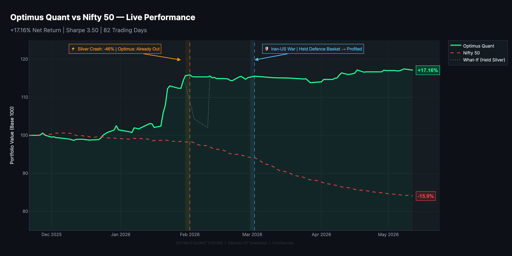

# Performance Validation Appendix — Optimus Quanta Infrastructure Validation

> **Scope:** Public-safe infrastructure validation, operational observations, and stress-scenario evidence
> **Status:** Summary prepared from controlled forward-simulation and pilot-ledger validation records

These figures are presented as operational evidence of infrastructure behavior under controlled forward-simulation or pilot-ledger conditions. They are not projected investor returns, investment advice, or a guarantee of future performance.

This appendix does not disclose private strategy rules, broker credentials, account data, live positions, private repository details, execution logic, or proprietary alpha logic.

---

## 1. Validation Snapshot

| Metric                            | Current Observation                                     |
| :-------------------------------- | :------------------------------------------------------ |
| Validation Mode                   | Controlled forward-simulation / pilot-ledger conditions |
| Observed Net Result               | 17.13%                                                  |
| Observed Max Drawdown             | 4.29%                                                   |
| Risk-Adjusted Validation Ratio    | 3.99                                                    |
| Workflow Quality Factor           | 1.85                                                    |
| Modeled Slippage Tolerance        | 0.1956%                                                 |
| Observed Workflow Events / Trades | 406                                                     |

The snapshot is intended to show how the infrastructure behaved during the observed validation conditions. It should not be interpreted as an audited performance statement or an indication of returns available to an investor.

---

## 2. Master Equity Curve

Figure: Optimus Quanta master equity curve versus Nifty 50 during the controlled forward-simulation / pilot-ledger validation window. The chart is shown as operational evidence of infrastructure behavior, not as projected returns, investment advice, or a guarantee of future performance.

### Chart Note

The master equity curve image displays +17.16% net return, Sharpe 3.50, 82 trading days, and Nifty 50 around -15.9% for the plotted validation view. If this differs slightly from the public website metric cards, treat the chart as the latest visual validation artifact and keep the metric-card table aligned with [optimusquanta.com](https://optimusquanta.com) until the website is updated.

---

## 3. Stress-Tested Performance Highlights

Optimus Quanta's validation evidence is not limited to a smooth equity curve. The more important observation is how the infrastructure behaved during hostile live-market conditions: commodity dislocation, geopolitical shock, choppy market structure, drawdown pressure, and benchmark weakness.

The master equity curve records the following validation view:

| Stress-Tested Metric      | Observed Validation View                      |
| :------------------------ | :-------------------------------------------- |
| Optimus Quanta Net Result | +17.16% on the plotted master equity curve    |
| Nifty 50 Comparison       | Approximately -15.9% on the same plotted view |
| Sharpe Ratio              | 3.50 on the plotted validation view           |
| Trading Days              | 82                                            |
| Observed Max Drawdown     | 4.29% from the public validation snapshot     |
| Workflow Events / Trades  | 406 from the public validation snapshot       |

These figures are shown as live-market forward-validation / pilot-ledger evidence. They are not an audited investor statement, investment advice, projected returns, or a guarantee of future performance.

### Stress Windows Captured

| Stress Window                  | What Happened                                                                 | Optimus Quanta Validation Observation                                                                                                                                      |
| :----------------------------- | :---------------------------------------------------------------------------- | :------------------------------------------------------------------------------------------------------------------------------------------------------------------------- |
| Precious Metals / Silver Crash | A severe commodity dislocation occurred; silver fell around 46% in the recorded stress window | The chart records "Optimus: Already Out"; under conservative validation assumptions, the approximate avoided-risk scenario was ~8–12% of capital |
| Iran-US War Window             | Geopolitical shock created cross-asset volatility                             | The chart records "Held Defence Basket → Profited," showing that the infrastructure preserved reviewable workflow evidence during a geopolitical stress window             |
| Choppy Market Regime           | Market direction remained unstable and inconsistent                          | The system maintained a reviewable workflow across signal changes, drawdown monitoring, event volume, and operator review                                                   |
| Benchmark Weakness             | Nifty 50 declined materially in the plotted validation view                   | Optimus Quanta remained positive in the same plotted validation view                                                                                                       |

### Why This Matters

The key validation claim is not that Optimus Quanta can predict every shock. The key claim is that the infrastructure produced a reviewable operating record during severe market stress.

The evidence supports that:

- the equity curve remained resilient during stress windows;
- benchmark-relative behavior was materially stronger in the plotted validation view;
- risk and exposure state remained reviewable;
- event annotations were preserved as validation artifacts;
- operator-supervised workflow discipline remained visible;
- the system generated post-event evidence instead of relying on memory; and
- the infrastructure could be evaluated under adverse market conditions, not only in clean trending markets.

### Important Boundary

This section does not claim permanent alpha, guaranteed crash protection, geopolitical prediction ability, or repeatable profits during future stress events. It presents stress-window behavior as operational validation evidence for the infrastructure.

---

## 4. What Is Being Validated

Optimus Quanta is evaluated as an infrastructure and operating workflow, not solely as a return series. The validation process reviews:

| Validation Area | Operational Question |
| :--- | :--- |
| Research workflow | Can market observations be captured, tested, and reviewed consistently? |
| Data and monitoring | Do scanners, dashboards, and telemetry remain coherent during changing conditions? |
| Risk review | Are drawdown, exposure, and workflow exceptions visible to the operator? |
| Broker workflows | Can broker-facing states and operational constraints be handled reliably? |
| Slippage tolerance | Does the modeled workflow remain usable under non-ideal execution assumptions? |
| Operator supervision | Can alerts, reviews, and interventions be performed without obscuring system state? |
| Reconciliation | Can intended, observed, and recorded workflow states be compared and reviewed? |

Infrastructure validation does not establish a permanent market edge. It provides evidence that research, monitoring, risk review, and operator-supervised workflows can function together under the observed conditions.

---

## 5. Methodology and Interpretation

The public validation view uses controlled forward-simulation or pilot-ledger records rather than a claim of audited investor performance. Observations may include modeled costs, slippage assumptions, workflow events, market-data inputs, and operator-reviewed system states.

### Interpretation Principles

- Results describe the observed validation window only.
- Metric cards and visual artifacts can reflect different snapshot times.
- Drawdown is treated as an operational risk observation, not merely a presentation statistic.
- Workflow events or trades are counts from the validation process and do not disclose underlying strategy logic.
- Operator supervision is part of the operating model.
- No public artifact should be used to infer private rules, positions, account activity, or execution logic.

---

## 6. Operational Stress-Scenario Evidence

These operational validation case studies examine infrastructure behavior during demanding market conditions. They focus on monitoring, risk-state visibility, exposure review, alerting, reconciliation, and operator-supervised workflow discipline.

### Commodity Stress Scenario — Precious Metals / Silver Crash

The validation window included a severe precious-metals dislocation, visible in the master equity curve as the “Silver Crash” event marker.

The chart annotation records: **“Silver Crash: -46% | Optimus: Already Out.”** This is included as a validation artifact showing that the infrastructure had a reviewable risk-state and position-state record before the full stress move unfolded.

This case study is important because it tests whether the infrastructure could preserve visibility and operational discipline during a fast adverse commodity-market shock.

#### Numeric Stress Snapshot

The silver crash case is included because it was a severe commodity stress event, not a normal market fluctuation. Approximate validation records from the stress window show the following market dislocation:

| Instrument         | Approx Peak Price | Approx Crash Low | Approx Drop |
| :----------------- | ----------------: | ---------------: | ----------: |
| MCX Silver Futures |        ~₹4,21,000 |       ~₹2,26,000 | **-46.18%** |
| MCX Silver Micro   |        ~₹4,28,000 |       ~₹2,31,000 | **-46.05%** |
| MCX Silver Mini    |        ~₹4,22,000 |       ~₹2,33,000 | **-45.30%** |
| MCX Gold Futures   |        ~₹1,81,000 |       ~₹1,42,000 | **-24.65%** |
| MCX Gold Petal     |          ~₹19,100 |         ~₹15,000 | **-21.52%** |

#### Position-State / Exit Snapshot

Internal validation records show that relevant commodity exposure was already reduced or exited before the full stress move unfolded. Approximate exit-state evidence:

| Instrument    | Exit Date    | Approx Exit Price | Approx Crash Low | Approx Avoided Move |
| :------------ | :----------- | ----------------: | ---------------: | ------------------: |
| MCX:SILVER    | Jan 29, 2026 |        ~₹3,77,000 |       ~₹2,26,000 |          **~40.1%** |
| MCX:SILVERM   | Jan 29, 2026 |        ~₹3,85,000 |       ~₹2,33,000 |          **~39.5%** |
| MCX:SILVERMIC | Jan 29, 2026 |        ~₹3,95,000 |       ~₹2,31,000 |          **~41.5%** |
| MCX:GOLDM     | Jan 29, 2026 |        ~₹1,71,000 |       ~₹1,42,000 |          **~16.9%** |
| MCX:GOLDPETAL | Jan 29, 2026 |          ~₹18,300 |         ~₹15,000 |          **~18.1%** |

#### Conservative Avoided-Risk Scenario

| Scenario                                 | Estimated Impact If Exposure Had Been Held |
| :--------------------------------------- | :----------------------------------------- |
| Silver positions held through full crash | **~6–8% of capital**                       |
| Gold positions held through full crash   | **~1–3% of capital**                       |
| Conservative total avoided-risk estimate | **~8–12% of capital**                      |

This numeric case study is presented as operational validation evidence. It shows that the infrastructure preserved a reviewable record of exposure state, exit state, risk state, and post-event reconstruction during a severe commodity dislocation.

It does not claim that Optimus Quanta can always exit before future crashes, predict commodity shocks, guarantee drawdown protection, or produce repeatable profits in future black-swan events.

| Validation Area       | What Was Reviewed                                                                                              |
| :-------------------- | :------------------------------------------------------------------------------------------------------------- |
| Exposure visibility   | Whether the system preserved a clear view of commodity exposure before and during the stress window            |
| Risk-state tracking   | Whether risk status, drawdown behavior, and alerts remained reviewable                                         |
| Position-state review | Whether the system retained a clear record of whether relevant exposure was active, reduced, or already exited |
| Operator workflow     | Whether the operator could review the situation without losing dashboard or reporting clarity                  |
| Post-event evidence   | Whether the event could be reconstructed after the fact without relying on memory or screenshots alone         |

The operational observation from this scenario is narrow: the infrastructure preserved a usable view of exposure, risk state, and workflow history during a major commodity stress event.

This does **not** mean the system can always exit before future crashes. It does **not** claim prediction ability, guaranteed protection, or repeatable profits during commodity shocks. The case is presented only as infrastructure validation evidence.

### Geopolitical Stress Scenario — Iran-US War Window

The master equity curve also visually marks the Iran-US war window. This case study reviews infrastructure behavior during elevated geopolitical uncertainty and cross-asset volatility.

The review focuses on:

- cross-asset monitoring and market-state visibility;
- defence-basket handling within the observed workflow;
- dashboard continuity and alert review;
- portfolio and risk-state assessment;
- preservation of workflow records; and
- operator-supervised decision discipline.

The chart contains the annotation **“Iran-US War | Held Defence Basket → Profited.”** This wording is treated only as a chart artifact and observed validation note for that specific window. It does not imply geopolitical prediction, advance knowledge of the event, guaranteed protection, or repeatable profits from future war-related market moves.

The relevant evidence is that the workflow remained visible, reviewable, and operationally coherent under the observed stress—not that the same market outcome can be reproduced.

### Choppy-Market Regime Scenario

The validation window also included periods of unstable and directionally inconsistent market behavior. These periods were used to examine whether repeated signal changes, drawdown monitoring, workflow-event volume, and operator review remained manageable.

This scenario tested whether:

- monitoring remained usable as market direction changed;
- repeated signal and workflow-state changes could be reviewed;
- drawdown and risk-state visibility remained central;
- workflow-event volume remained operationally manageable;
- records could be reconciled after changing conditions; and
- operator-supervised processes maintained discipline.

The relevant evidence is infrastructure survivability, observability, reconciliation, and workflow discipline—not return bragging or a claim that choppy markets can be navigated without loss.

### What These Stress Scenarios Demonstrate

- Monitoring surfaces remained usable under stress.
- Risk review and drawdown visibility remained central.
- Event evidence could be reviewed after the fact.
- Workflow records were preserved.
- Operator-supervised processes remained explicit.
- Stress scenarios could be reviewed without exposing proprietary strategy rules.
- Chart annotations were preserved as validation artifacts.
- The system retained operational evidence around exposure, risk state, and workflow review.
- Public discussion can describe infrastructure behavior without exposing private alpha logic.

### What These Stress Scenarios Do Not Prove

- They do not prove permanent alpha.
- They do not prove future profitability.
- They do not guarantee future drawdown limits.
- They do not imply advance knowledge of shocks.
- They do not provide investment advice or return projections.
- They do not reveal private strategy or execution logic.

---

## 7. Risk and Drawdown Review

Observed max drawdown is reported in the current public snapshot as **4.29%**. This figure is part of the infrastructure validation record and should be read alongside the validation mode, modeled assumptions, and limitations in this appendix.

The risk-review process emphasizes:

- visibility into adverse path behavior;
- consistent exposure and drawdown monitoring;
- exception and reconciliation review;
- modeled slippage tolerance;
- operator-supervised responses; and
- preservation of an auditable operational record.

No drawdown figure guarantees a future risk limit. Different instruments, regimes, liquidity conditions, data quality, and operational circumstances can produce materially different outcomes.

---

## 8. Evidence Supported by the Current Validation

The current public evidence supports a limited set of infrastructure observations:

- systematic research and monitoring workflows operated together during the observed window;
- dashboards and risk-review surfaces provided operational visibility;
- modeled slippage tolerance was included in the public validation snapshot;
- workflow events were recorded at sufficient scale to support process review;
- operator supervision remained explicit rather than being presented as fully autonomous execution; and
- stress scenarios could be reviewed without publishing proprietary logic or private account information.

The evidence does not prove permanent alpha, future profitability, investor returns, or immunity from operational and market risk.

---

## 9. Limitations and Disclosure

| Limitation | Public Interpretation |
| :--- | :--- |
| Controlled validation conditions | Not equivalent to audited investor performance |
| Limited observation window | Does not cover every market regime or failure mode |
| Modeled assumptions | Real-world costs and execution conditions may differ |
| Operator supervision | Results reflect an operator-supervised workflow |
| Private implementation | Public evidence cannot independently reveal or audit proprietary logic |
| Snapshot timing | Website cards and chart artifacts may update at different times |

Optimus Quanta remains private quant research and trading infrastructure. Public materials are intentionally limited to disclosure-safe evidence about infrastructure behavior. They do not expose private strategy rules, credentials, account data, live positions, execution logic, or proprietary implementation details.

---

## 10. Relationship to Public Repositories

Selected public repositories demonstrate portions of the broader research and engineering practice, such as scanners, backtesting, analytics, and risk tooling. They are public evidence of development capability, not a release of the private Optimus Quanta system.

The public repositories should not be interpreted as containing the complete infrastructure, production configuration, private datasets, broker integrations, strategy logic, or live operational state.

---

## 11. Closing Interpretation

The purpose of this appendix is to document evidence that Optimus Quanta can support a disciplined research and operational workflow under observed validation conditions.

The central claim is deliberately narrow: the infrastructure demonstrated measurable, reviewable behavior across research, monitoring, analytics, risk review, broker workflows, and operator-supervised execution support. Continued validation is required, and no result in this document is investment advice, a projected investor return, or a guarantee of future performance.
